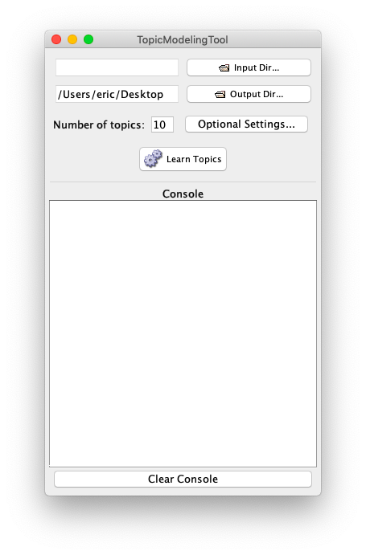
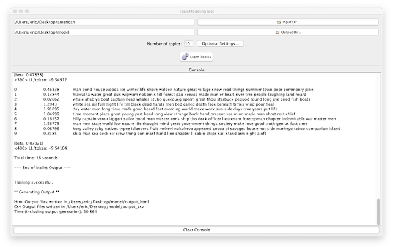
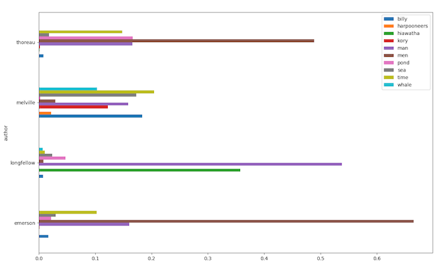

# Topic modeling

This is a short tutorial on the topic of... topic modeling.

## Introduction

Succinctly put, topic modeling is an unsupervised machine learning process used to enumerate the themes in a textual corpus.

Let's unpack that definition. Machine learning is a computing technique used to make decisions. Unlike traditional computer programming complete with sets of if-then and do-while statements, machine learning ingests sample data, makes observations against it, formats the observations as a matrix, applies linear algebra against the result, identifies patterns &amp; anomalies in the data, and uses them to classify &amp; cluster the observations. Through the use of machine learning, a person can predict the weather, ascertain the authorship of a sonnet, or complete the following statement: "People like you also like..."

In the unsupervised machine learning process there are no labels for the sample data. The columns (observations) in the matrix may have values such as temperature, altitude, date, time, relative humidity, etc, but each row in the matrix has no meaningful label, but rather a meaningless identifier. On the other hand, in a supervised machine learning process each row in the matrix has one or more meaningful labels. For example, the columns might be number of leaves, height, date of blooming, and the rows are different species of plants. In a textual sense, the columns might be relative frequency of words, date of publication, and over-all readability score, where row values could be author names, genres, or genders. Labels, in supervised machine learning processes, are usually non-numeric. 

Topic modeling is an unsupervised machine learning process. It identifies sets of words which cluster around each other. Topic modeling outputs words in close proximity to other words. These "clusters" are deemed to be topics or the themes in a corpus. Because topic modeling is unsupervised -- unlabeled -- this form of machine learning is often characterized as allowing the data "to speak for itself."

Topic modeling is a good way to get a sense of the "aboutness" of a document or set of documents.

## Tutorial

Topic modeling is implemented quite a number of ways, but [MALLET](http://mallet.cs.umass.edu) is the grand-daddy of the applications. Written as a Java .jar file, it is intended to be integrated into other Java applications, but it is also implemented as a command-line application. As such it is not necessarily for the uninitiated. Alas. Another application -- [Topic Modeling Tool](https://github.com/senderle/topic-modeling-tool) -- is very much based on MALLET but has a GUI interface, and consequently is a much gentler introduction to topic modeling. To continue with this tutorial, the reader is expected to download and install the Topic Modeling Tool. Installation-specific details are beyond the scope of this tutorial, but when you are done, you ought to see a dialog box very similar to the following:

Once you get this far, download some [sample data](https://osf.io/fyqh8/?view_only=96827ce8db844cb4ab352f07bd5ebad0). To make your life easier, save it on your computer's desktop, uncompress it, and you ought to have a number of directories &amp; files as your disposal:

   * american
   * american.csv
   * baxter
   * baxter.csv
   * catalog
   * catalog
   * deerslayer
   
Create a directory on your computer's desktop called model, and then configure the Topic Modeling Tool. More specifically, denote the input directory to be "american", denote the output directory to be the newly created model directory and click the Learn Topics button. After a bit of computation, the application will create 10 topics, and each topic will be enumerated with as many as twenty words, like the following:

You can then peruse the files in the models directory to see how each topic is associated with each document. Very interesting? Enlightening? Repeat the same proces with other directories from the samples data set. What "topics" were generated by the Tool?

Topic Modeling Tool comes with a <em>very</em> useful feature. Create a CSV (comma-separated value) file denoting the names of the files as well as labels associated with each file, and then tell the Tool to integrate its output with the CSV file. The CSV file then created by the Tool can be charted/graphed to illustrate trends ("topics") associated with each label. For example, click the "Optional settings" button and choose "american.csv" as the metadata file. Run the tool again, and then open the model/output_csv/topics-metadata.csv in your favorite spreadsheet application. Chart the results as a pivot table and you ought to see something like the following graph:

Such illustrates the topics associated with each author. Other associations can be illustrated by any number of other labels associated with the given files: gender, genre, year, etc. Using this technique the researcher can identify topics (read "themes") associated with types of literature, dates written, or the sexual identity of an author.

Practice with the other data sets in the sample data. Begin sans the metadata files. After becoming familiar with the topics of each dataset, include the associated metadata files to learn how they are associate with different labels.

The process of topic modeling requires practice. It does not output truth as much as it outputs observations. Use the observations as the fodder for humanistic analysis. Ask yourself, "How can I use this to 'read' large volumes of text?" or "How can I use this to learn about my corpus?"

--- 
Eric Lease Morgan &lt;emorgan@nd.edu&gt;  
February 19, 2019

